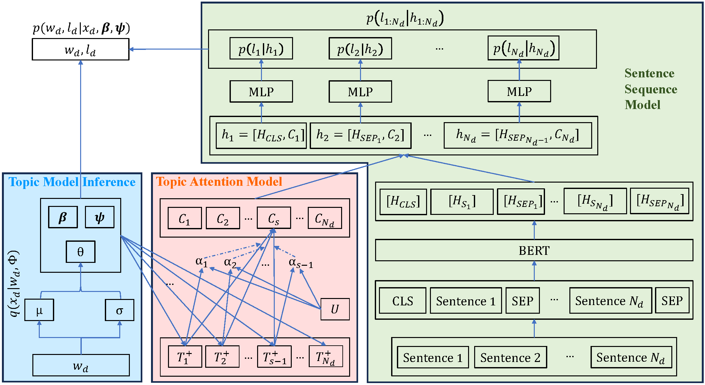
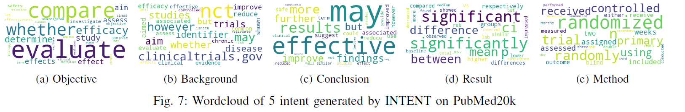
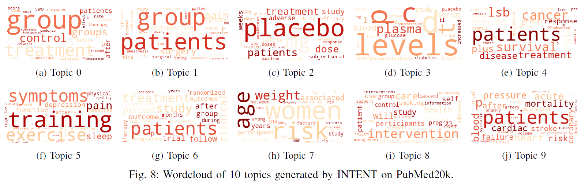

# INTENT
Implementation of "Pre-Trained Language Models with Topic Attention for Supervised Document Structure Learning"
## Dependency:
* Pytorch==1.10.2
* Transformer==4.18.0


## The input data: 
+ Data: *.text, each line is the corresponding text of a sentence in each document.
+ Label: *.label, each line is the corresponding label for a sentence in each document.
+ Meta: *.meta, each line contains the number of sentences for each document.

For a custom dataset, please check the preprocessing scripts.

## Training:
Check the train.py params for a more detail parameter setting. Example of Chemical dataset:
```
python train.py --dataset_name chemical --epochs 100 --hidden_size 250 --print_every 1 --num_topics 10 --use_topic 1 --lr1 0.005 --lr2 1e-5 --bs 22 --device cuda:0
```

## Inference network:


## Wordcloud of Intent and Topic on Pubmed20k dataset:




